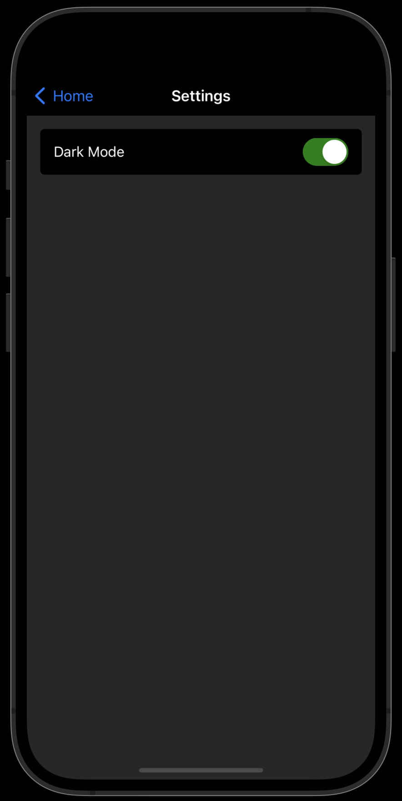

# @app-name/monorepo

To reuse this monorepo, replace `app-name` and run yarn on the root project.

### UI

Desktop                    |  Desktop (Dark)
:-------------------------:|:-------------------------:
 | 

Mobile                     |  Mobile (Dark)
:-------------------------:|:-------------------------:
 | 

Mobile Settings (Dark)     |
:-------------------------:|
 |

## Setup:

```
yarn
```

Then setup the monorepo:

```
lerna bootstrap
```

### Services:

To run an individual service use:

```
yarn run api:start:dev
yarn run web:start:dev
```

### Assistance

To add a new package, from the root directory:

```
lerna add <package> --scope=<service/package> [--scope=c --scope=d]
```

E.g.

```
lerna add @app-name/ui --scope=@app-name/web --dev
```

Or try:

```
yarn workspace @app-name/expo add react-devtools@4.22.0 --dev
```

To remove an existing package:

1. Remove it from the local package/service
2. Run the below

```
lerna bootstrap --scope=<service/package> --no-ci --force-local
```

## Documentation

To generate the dependency graph seen above, run:

```
npx graph
```
